Exercise 4 - 1
================

Clustering and PCA
------------------

I run both clustering and PCA on the 11 properties of wine data.

I run clustering first.

I use kmeans++ method to clustering.

``` r
# divide the data in 2 clusters to distinguish red from white
clust1 = kmeanspp(x,k = 2, nstart = 50)
```

    ## 
    ##   red white 
    ##  1575    68

    ## 
    ##   red white 
    ##    24  4830

Regardless small error, clustering can distinguish white and red generally. The wines belong to the cluster 1 is white generally and the wines belobg to the cluster 2 is red in general. However it is hard to sort the higher frome the lower quality wines, the result is below:

    ## 
    ##   3   4   5   6   7   8 
    ##  12  74 702 640 198  17

    ## 
    ##    3    4    5    6    7    8    9 
    ##   18  142 1436 2196  881  176    5

As we can see, the quality is evenly distributed.

Next I use PCA to divide the wine data.

See difference between white wine and red wine, and it can easily tell that PC1 is the best way to distinguish between white and red wine.

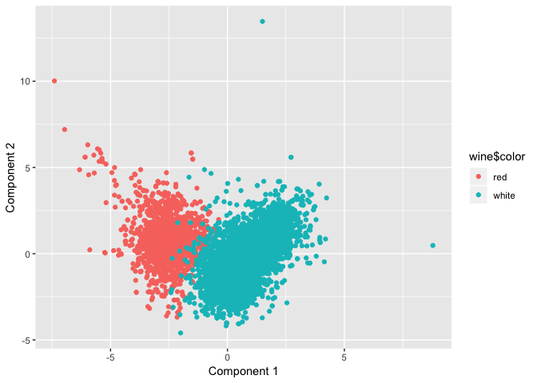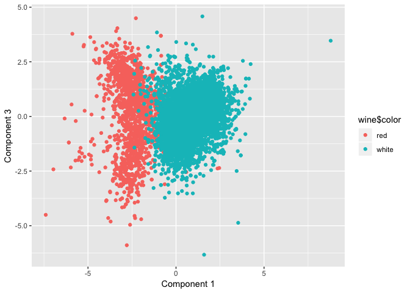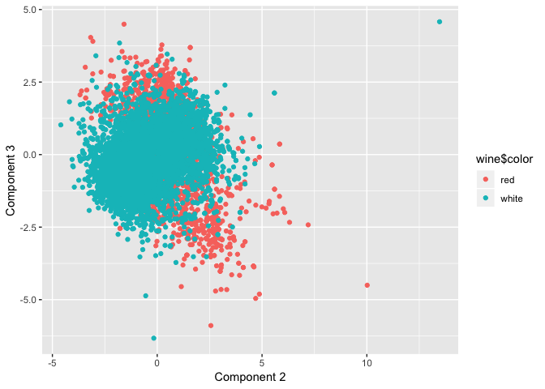

To distingusih between quality. 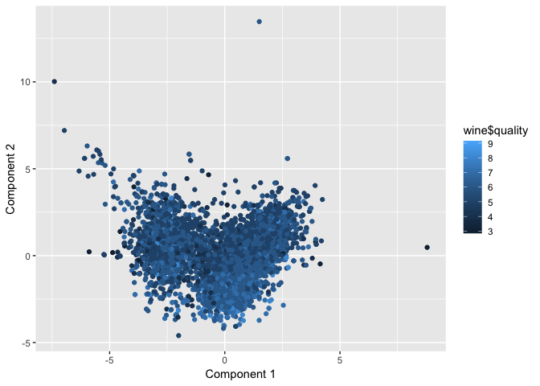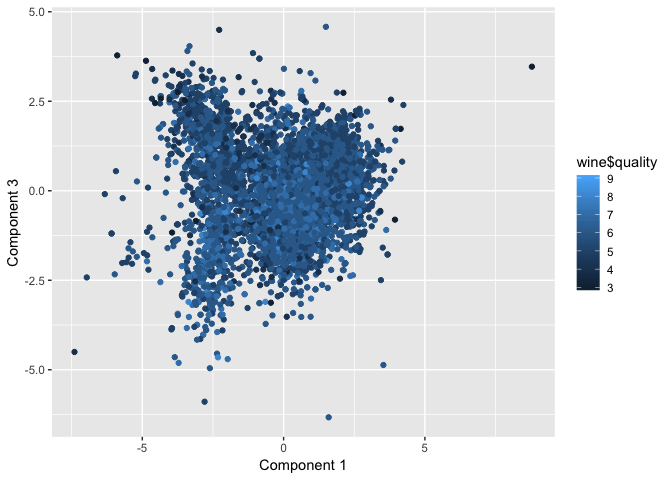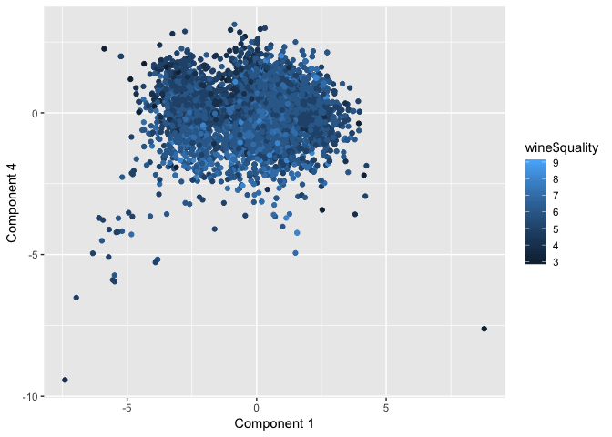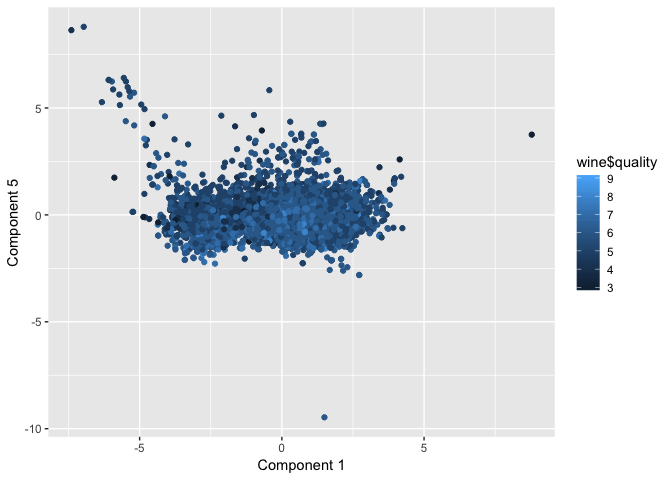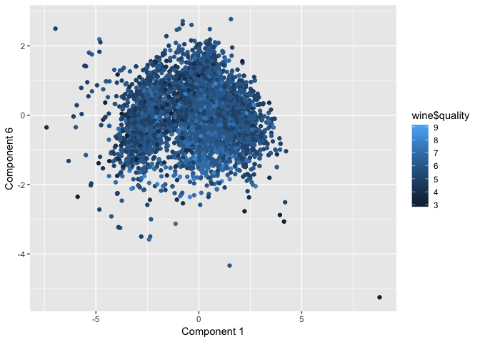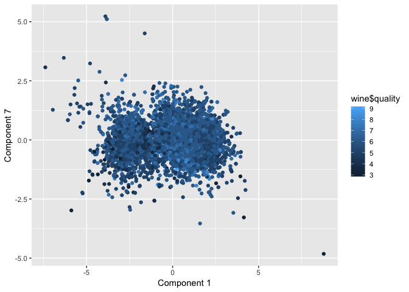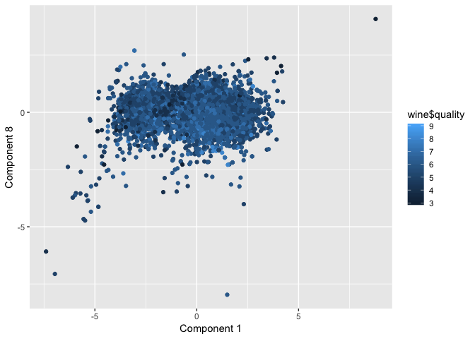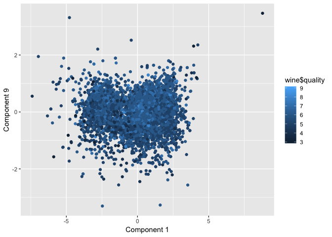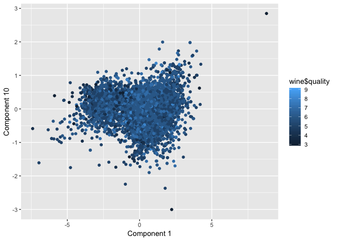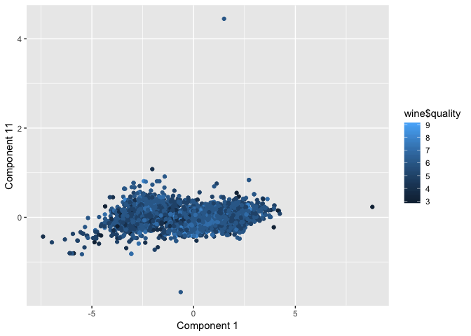

As we can see above, it can not sort the wine according to quality no matter what component it is.

### Question

1.Which dimensionality reduction technique makes more sense to you for this data?

I think both dimensionality reduction technique makes sense, but PCA makes more senses. Because PCA can show the part that is overlapped, it is more precise.

2.Does this technique also seem capable of sorting the higher from the lower quality wines?

I think both the technique can not sort the higher from the lower quality wines, as we can see above.
