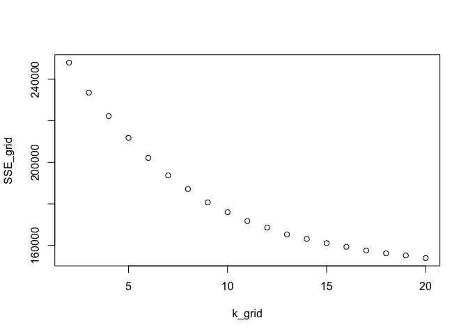

Exercise 4 - 1
================

Clustering and PCA
------------------

I run both clustering and PCA on the 11 properties of wine data.

I run clustering first.

I use kmeans++ method to clustering.

``` r
# divide the data in 2 clusters to distinguish red from white
clust1 = kmeanspp(x,k = 2, nstart = 50)
```

    ## 
    ##   red white 
    ##  1575    68

    ## 
    ##   red white 
    ##    24  4830

Regardless small error, clustering can distinguish white and red generally. The wines belong to the cluster 1 is white generally and the wines belobg to the cluster 2 is red in general. However it is hard to sort the higher frome the lower quality wines, the result is below:

    ## 
    ##   3   4   5   6   7   8 
    ##  12  74 702 640 198  17

    ## 
    ##    3    4    5    6    7    8    9 
    ##   18  142 1436 2196  881  176    5

As we can see, the quality is evenly distributed.

Next I use PCA to divide the wine data.

See difference between white wine and red wine, and it can easily tell that PC1 is the best way to distinguish between white and red wine.


To distingusih between quality. 

As we can see above, it can not sort the wine according to quality no matter what component it is.

### Question

1.Which dimensionality reduction technique makes more sense to you for this data?

I think both dimensionality reduction technique makes sense, but PCA makes more senses. Because PCA can show the part that is overlapped, it is more precise.

2.Does this technique also seem capable of sorting the higher from the lower quality wines?

I think both the technique can not sort the higher from the lower quality wines, as we can see above.

HW4-2
================

Overall view about data.

 

Categorize as spam-bot if number of spam tweets&gt;1, as adult-bot if adult rate &gt; 20%, and remove them. We are relatively strict in removing users who post spams but more tolerent if users post adult content. This is because adult content is an option of interest for normal adult users, but normal users are not likely to post spams.

Clustering
==========

Use k++ method to select k

 We choose k=10 for clustering.

We can see that the largest clusters includes people with interests in health&fitness, sports-fandom,cooking, college/univ, news&politics, dating&photosharing.

Pca to analyze the most prominent features of users
===================================================

    ## Importance of first k=8 (out of 35) components:
    ##                           PC1     PC2     PC3     PC4     PC5     PC6
    ## Standard deviation     2.1207 1.70038 1.59481 1.53648 1.48281 1.37298
    ## Proportion of Variance 0.1285 0.08261 0.07267 0.06745 0.06282 0.05386
    ## Cumulative Proportion  0.1285 0.21111 0.28378 0.35123 0.41405 0.46791
    ##                            PC7     PC8
    ## Standard deviation     1.28714 1.19265
    ## Proportion of Variance 0.04734 0.04064
    ## Cumulative Proportion  0.51524 0.55589


    ##   college_uni online_gaming         adult 
    ##   -0.09233398   -0.07214340   -0.05458998 
    ##   college_uni online_gaming         adult 
    ##   -0.09233398   -0.07214340   -0.05458998 
    ##   college_uni online_gaming         adult 
    ##   -0.09233398   -0.07214340   -0.05458998 
    ##   college_uni online_gaming         adult 
    ##   -0.09233398   -0.07214340   -0.05458998 
    ##   college_uni online_gaming         adult 
    ##   -0.09233398   -0.07214340   -0.05458998 
    ##   college_uni online_gaming         adult 
    ##   -0.09233398   -0.07214340   -0.05458998 
    ##   college_uni online_gaming         adult 
    ##   -0.09233398   -0.07214340   -0.05458998 
    ##   college_uni online_gaming         adult 
    ##   -0.09233398   -0.07214340   -0.05458998

The result seems average and is a group of correlated interests.

HW3
================

Find some interesting association rules for these shopping baskets Pick your own thresholds for lift and confidence

Show the top 20 frequent items in the baskets using the bar chart, and the bar chart shows the basic scene of transactions. 


In this part, we choose the support as 0.1, thus the probability of transactions that contain all these items in the basket will be higher than 0.1. There are around 15,000 transactions, thus the support 0.1 will give more than 1500 times combinations. For the confidence, we choose 0.6, since confidence rate should be larger than support rate. Lower confidence rate will give more association. The graph shows that when confidence rate is lower than 0.6, the number of association will not go up as the confidence rate decreases. Hence, we think 0.6 is the best confidence rate to choose.

    ## To reduce overplotting, jitter is added! Use jitter = 0 to prevent jitter.


We can visualize the association rules through network graph. The larger the label size, the more frequent this item appeared in a transaction, which is another representation of the barplot. The dark the color of the edge, the higher the lift of the association, which corresponded to what I found. We use the graph to show the association rules. In the following graph, the label size represents the frequency of the item, the color degree represents the lift of the association. The dark the color is, the higher lift is.


