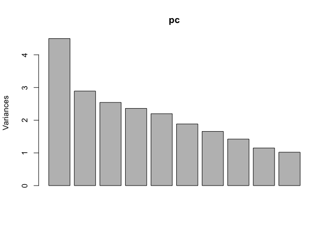

HW4-2
================

Overall view about data.

 Categorize as spam-bot if number of spam tweets&gt;1, as adult-bot if adult rate &gt; 20%, and remove them. We are relatively strict in removing users who post spams but more tolerent if users post adult content. This is because adult content is an option of interest for normal adult users, but normal users are not likely to post spams.

Clustering
==========

Use k++ method to select k

 We choose k=10 for clustering.

We can see that the largest clusters includes people with interests in health&fitness, sports-fandom,cooking, college/univ, news&politics, dating&photosharing.

Pca to analyze the most prominent features of users
===================================================

    ## Importance of first k=8 (out of 35) components:
    ##                           PC1     PC2     PC3     PC4     PC5     PC6
    ## Standard deviation     2.1207 1.70038 1.59481 1.53648 1.48281 1.37298
    ## Proportion of Variance 0.1285 0.08261 0.07267 0.06745 0.06282 0.05386
    ## Cumulative Proportion  0.1285 0.21111 0.28378 0.35123 0.41405 0.46791
    ##                            PC7     PC8
    ## Standard deviation     1.28714 1.19265
    ## Proportion of Variance 0.04734 0.04064
    ## Cumulative Proportion  0.51524 0.55589

    ##   college_uni online_gaming         adult 
    ##   -0.09233398   -0.07214340   -0.05458998 
    ##   college_uni online_gaming         adult 
    ##   -0.09233398   -0.07214340   -0.05458998 
    ##   college_uni online_gaming         adult 
    ##   -0.09233398   -0.07214340   -0.05458998 
    ##   college_uni online_gaming         adult 
    ##   -0.09233398   -0.07214340   -0.05458998 
    ##   college_uni online_gaming         adult 
    ##   -0.09233398   -0.07214340   -0.05458998 
    ##   college_uni online_gaming         adult 
    ##   -0.09233398   -0.07214340   -0.05458998 
    ##   college_uni online_gaming         adult 
    ##   -0.09233398   -0.07214340   -0.05458998 
    ##   college_uni online_gaming         adult 
    ##   -0.09233398   -0.07214340   -0.05458998

The result seems average and is a group of correlated interests.
