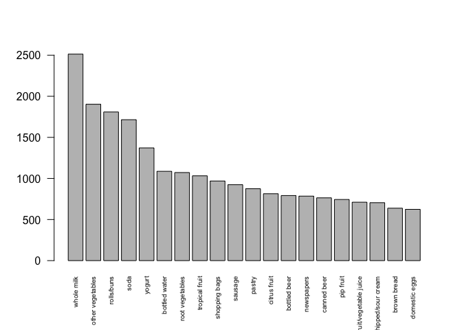

HW3
================

Find some interesting association rules for these shopping baskets Pick your own thresholds for lift and confidence

Show the top 20 frequent items in the baskets using the bar chart, and the bar chart shows the basic scene of transactions. 

In this part, we choose the support as 0.1, thus the probability of transactions that contain all these items in the basket will be higher than 0.1. There are around 15,000 transactions, thus the support 0.1 will give more than 1500 times combinations. For the confidence, we choose 0.6, since confidence rate should be larger than support rate. Lower confidence rate will give more association. The graph shows that when confidence rate is lower than 0.6, the number of association will not go up as the confidence rate decreases. Hence, we think 0.6 is the best confidence rate to choose.

    ## To reduce overplotting, jitter is added! Use jitter = 0 to prevent jitter.

We can visualize the association rules through network graph. The larger the label size, the more frequent this item appeared in a transaction, which is another representation of the barplot. The dark the color of the edge, the higher the lift of the association, which corresponded to what I found. We use the graph to show the association rules. In the following graph, the label size represents the frequency of the item, the color degree represents the lift of the association. The dark the color is, the higher lift is.

